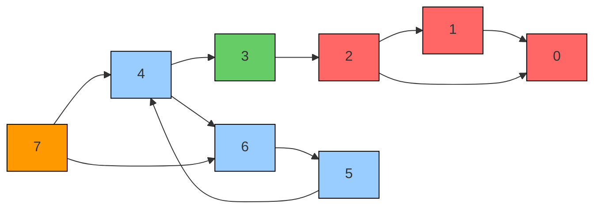
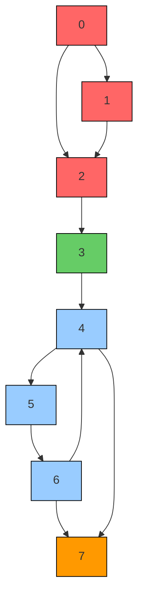

# Kosaraju's Algorithm
---
>[!summary] Algorithm for finding **strongly connected components** in a **directed** graph

# Explanation
---

The below diagram highlights the strongly connected components of an example graph

A property of strongly connected components is that they are maintained even if you reverse the edges in the graph. So the diagram below also maintains the exact same components.

Kosaraju's algorithm exploits this behaviour to find all strongly connected components in a graph.

## the algorithm

For Kosaraju's algorithm, we do the following 
### step 1: dfs
we run a [[DFS|Depth first search]] on each node of the graph, appending discovered nodes **post order** onto a [[stack]].

### step 2: reversal
reverse all the edges of the graph

### step 3: discovery
we pop the top element of the stack. we run a dfs starting from that node. All the newly visited nodes in that traversal make up the nodes in a strongly connected component. 
keep popping through the stack until its empty. the resultant list of components is your set of all strongly connected components

### video
Here is a supplementary video going through the process

## why do you need to go in order of finishing times? 
Why does step 1 of the algorithm matter? Why can't we just loop through nodes 1-N instead of in order of their appearance in the DFS? 
Refer to this chatgpt answer

>[!success] Why does order matter?
>Kosaraju’s algorithm relies on the fact that, **once you reverse the graph, performing DFS in decreasing order of finishing times** from the original graph guarantees that each DFS “root” (or the first picked node in each DFS) will lead you to discover exactly one strongly connected component (SCC) at a time, without overlap.
> 
> Here’s why the order of finishing times matters:
> 
> 1. **First Pass (on the original graph)**
>     
>     - You run DFS over all nodes (in any order).
>     - You track the finishing times of each node. (The “finishing time” is the moment a DFS finishes exploring all edges out of a given node.)
> 1. **Second Pass (on the reversed graph)**
>     
>     - You process nodes in **decreasing order** of their finishing times from the first pass.
>     - For each node (that is not yet visited in this second pass), you run DFS on the reversed graph and mark all reachable nodes as part of the same SCC.
> 
> ### Why Decreasing Finishing Times?
> 
> - When you pick a node with the **largest** finishing time first, in the reversed graph that node acts like a “root” of its strongly connected component.
> - If you were to choose nodes in **increasing** finishing time order (or in an arbitrary order), you could jump into the _middle_ of a component that has partial overlap with a previously discovered SCC. This would either cause you to skip an entire SCC or fragment it incorrectly.
> - In decreasing order, by the time you pick a node, you are guaranteed that none of its “ancestor” nodes (in the reversed graph sense) are unvisited. In other words, once you discover an SCC in one DFS, you will not accidentally discover those same nodes again in a future DFS—they are “closed off.”
> 
> ### Intuitive Explanation
> 
> Think of finishing times as telling you how “deeply” a node was explored in the first pass. A node with a high finishing time has a kind of “outward reach” in the original graph. When you reverse the graph, that node becomes an excellent place to start a DFS: it will “pull in” all the nodes that are in its strongly connected component.
> 
> If you picked nodes in the wrong order (e.g., smallest finishing times first), you might pick a node that is already reachable from a node you _should_ have started with. That disrupts the neat SCC-by-SCC discovery process Kosaraju’s depends on.
> 
> Hence, **decreasing order of finishing times** is not just a convention—it’s the key to ensuring that each DFS in the reversed graph discovers exactly one SCC without interfering with the others.

## code #todo