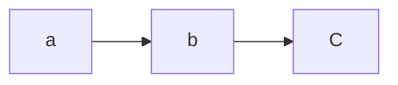

# Linked List
>
A linked list is a simple type of [[graph]] that can be one way, two way, or a mixture of the two. Often associated with cycle-detection problems or traversal problems.

Here is an example of a linked list:

## Cycle detection
The best algorithm for cycle detection is [[Floyd's TH algorithm| Floyd's Tortoise and Hare cycle detection algorithm]]

