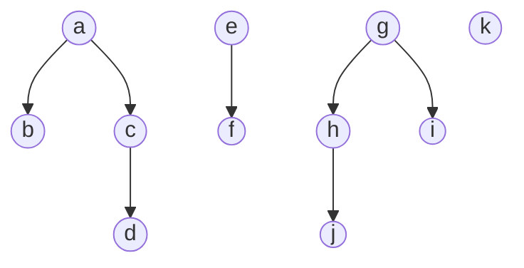

# Union-find structure
>
The union find structure is a simple [[tree|tree based]] data structure that holds different components. It has two **O(log(n)** operations, unite and find, respectively.

As said earlier, the union find structure is composed of multiple disjoint sets, meaning that each vertex does not belong to multiple sets. These sets are similar to [[tree|trees]], with all edges being pointed towards the root node.  Here is a visual example:



> note: imagine the arrows being the other way around, going up, instead of down. 

The root of each set will be known as the representative of that set. For example, in [[Kruskal's algorithm]], the union-find structure will initially begin with every node in the graph being its own component, therefore each node is its own representative. 

The **unite** function allows for two components to be joined together. The most effective method of achieving this will be to join the representative of the smaller set to the larger one.

The **find** function simply finds the representative of a node. This can be achieved by following the tree until we reach the root.

## Implementation
A common implementation of this structure is to have two arrays, the link array and the size array. The link array is a graph implementation which forwards any node to the node it is next linked to, looping back to itself if it is the representative. More specifically, for any node X:
$$link[X] = A$$ 
$$X \Longrightarrow A$$

The size array shows the size of the component that a certain node is in. This is done so that we don't need to constantly traverse an entire component to find it's size.

### find()
The find function works by following the link chain until we find a node that is linked to itself, the representative, and return that node. 
```c++
int find(int x)
{
	while(x != link[x]) x = link[x];
	return x;
}
```

### unite()
The unite function accepts two parameters, a and b, which do not have to be the representative nodes, therefore, we must set them as their representatives using the find() function. Once we find the representatives, we use the size array to find out which component is larger and then, set  ```link[smaller] = larger``` . 
```c++
void unite(int a, int b)
{
	a = find(a);
	b = find(b);

	if(size[a] < size[b]) swap(a,b);
	
	size[a] += size[b];
	link[b] = a;
}
```
This implementation is slightly modified (e.g with variable swapping) to minimize the amount of code needed, but *if* statements work fine.

