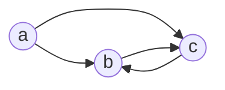
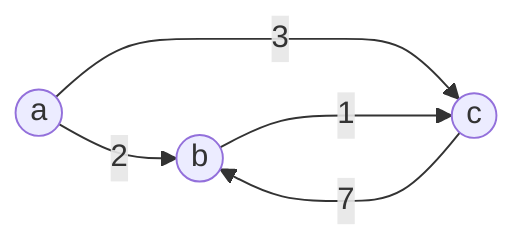

# Graph
>
Graphs are very important, they're just a set of things joined in a certain way

# Node list
A node list is a [[hash map]] representation of a graph where, each key represents a unique node, and the value is an array of the different nodes that is connected. Sometimes, it can be an array of pairs, where the first is a weight value and the second is the node itself. Like this

| Node | Neighbours    |
| ---- | ------------- |
| A    | {2: B},{3: C} |
| B    | {1: C}        |
| C    | {1: B}        |
| ...  |               |

---

# Edge list
An edge list is a vector of all the edges in a graph. This is very useful for graph algorithms that do not require data on a specific node's neighbours. It can also b e used alongside a [[#Node list]]. 

# Matrix representation
A matrix representation uses an $V*V$ [[matrix]], where for any given cell, it's row and column correspond to 2 nodes (numbered 0 to V-1), where the first node is connected to the second by a weighted value of that cell. This is especially useful for weighted graphs and somewhat combines the functionality of the [[#Edge list]] and [[#Node list]]. However it can be very inefficient for sparse graphs. Here is an example with the same graph from earlier, but with weights.

|     | A   | B   | C   |
| --- | --- | --- | --- |
| A   | -1  | 2   | 3   |
| B   | -1  | -1  | 1   |
| C   | -1  | 7   | -1  |

---

