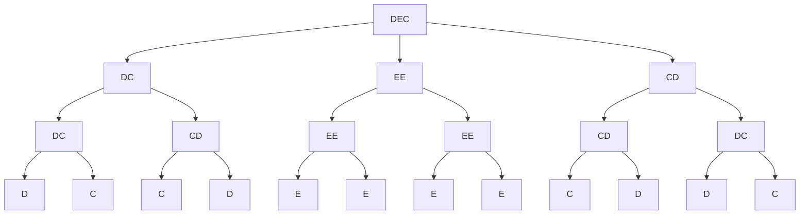

#bio 
# String rewriting
---
> A **very hard**, stress test, BIO 2007 Q3 problem [[dynamic programming]]


# Explanation
---
This problem requires a relatively strong [[dynamic programming]] knowledge and a good [[recursion]] knowledge. 

Essentially, first consider the tree of string rewriting steps, for example, for the example test case^[DEC 2 10]



since the order of the letters doesn't really matter once you've computed it you could set up a [[dynamic programming|DP]] structure as
$$
\Large
\text{dp [ depth ][ a ][ b ][ c ][ d ][ e ]}
$$
where `depth`  is how far down the tree you are, and `[a][b][c][d][e]` being the count of each of the respective letters.

We then recurse to each of the states.

# Code
---
```cpp
ll steps, p;
vector<int> nullvec;

string rule(string inp)
{
	string s = "";
	switch(inp[0])
	{
		case 'A':
			s = "B";
			break;
		case 'B':
			s = "AB";
			break;
		case 'C':
			s = "CD";
			break;
		case 'D':
			s = "DC";
			break;
		case 'E':
			s = "EE";
			break;
	}
	return s;
}


vector<int> dp[31][5][5][5][5][5];
pair<string, vector<int>> compute(string s, ll pos=1, ll depth=0)
{
	if(depth > steps)
	{
		vector<int> cnt(5,0);
		if(pos > p){
			return mp("", cnt);
		}
		cnt[s[0]-'A']++;
		return mp(s, cnt);
	}

	if(s.length() == 1) s = rule(s);

	vector<int> scnt(5,0);
	for(auto i : s) scnt[i-'A']++;

	vector<int> load = dp[depth][scnt[0]][scnt[1]][scnt[2]][scnt[3]][scnt[4]];
	if(load != nullvec and pos + accumulate(load.begin(), load.end(), 0) < p)
	{
		return mp("", load);
	}

	

	string tot = "";
	vector<int> cnt(5,0);
	for(auto i : s)
	{
		if(pos > p) break;
		auto ret = compute(string(1,i), pos, depth+1);

		tot += ret.first;
		for(int j = 0; j < 5; j++){
			cnt[j] += ret.second[j];
			pos += ret.second[j];
		}
	}

	dp[depth][scnt[0]][scnt[1]][scnt[2]][scnt[3]][scnt[4]] = cnt;
	return mp(tot, cnt);
}

void solve(int tc)
{
	string s; cin >> s;
	cin >> steps >> p; 

	if(p < 3) // special case
	{
		vector<int> cnt(5,0);
		for(int i = 0; i < p; i++)
		{
			cnt[s[i]-'A']++;
		}
		for(auto i : cnt)
			cout << i << " ";
		return;
	}

	auto out = compute(s); 

	for(auto i : out.second)
		cout << i << " ";
	cout << endl;

}
```