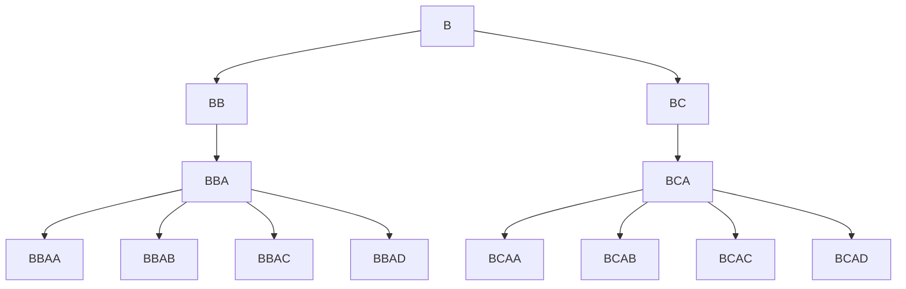

#bio
# parking
---
>[!summary] Hard bio problem 2022 q3


# Explanation
---
This requires knowledge on [[combinatorics]], check out [[modern art]] for a similar problem which uses similar techniques^[and has a better explanation lol].

Essentially, the first observation to note is that the [[tree]] of possibilities for different permutations of car preferences has the same number of branches at each layer, i.e it is symmetrical. 

for example, here are the branches for `cabd` :


This means, that if you were to list out the permutations, the number of occurences of a letter at a certain index of the string would be the same. E.g the number of B's and C's are split 50/50 through all the 8 permutations, for the second character. 

Now all we have to do, essentially, is make a function that counts the number of permutations in total `c_perms()`, and once we've done that we just have a simple recursive function that will go through each possible letter for each index of the string, and see how many possibilities it will have gone through.

Here is an example:
- Considering the example `cabd` above, with the same tree, there are 8 total possibilities. Let's say $n=5$ . 
- the first letter `B` takes up all 8 possibilities, which is the first possible letter greater than $n$, so we pick $B$ as our first letter. 
- For the next index, we have 2 letters, $B$ and $C$ which take up the permspace. $B$ takes up the first 4 possibilities and $C$ takes up the second 4. Since $C$ contains permutations 4-8, which contains the 5th permutation within it, we select $C$. 
- For the next index, again, like the first letter, the letter $A$ takes the entire permspace, so we select it. 
- At this point, we now have 4 possibilities, $A,B,C,D$. At this point, its simply a matter of incrementing, and we get our result $BCAA$.

### Now how did we deduce which letter corresponds to which selection?
---
well, when we select a letter, we will have already had a car come to a certain space and fill it, meaning that, for the next layer of the tree, the possible letters will be the ones below and including the letter which just places the car in its desired position (no passing by other filled spaces). The ones below where there are filled cars though, if there is a gap, then the car will go to the gap and not the desired spot. Thats what these lines are doing here:
```cpp
	char letter = ('A'+ (find(layout.begin(),layout.end(),'a'+l) - layout.begin()) );
	letter = letter - parts[l] + choice;
```

### How did we count the permutations?
---
We count the permutations by looking at each index and multiplying by the number of possibilities recursively. 

So considering, the same `cabd` example. 
In the first index, there are no cars already parked, so there is only one possibility, therefore its just 1.
the next index has the second space filled, this means car B can go into position B or position C, because of the explanation to [[#Now how did we deduce which letter corresponds to which selection?]], meaning we multiply by 2. 
In the index after that, we need car C to go into position A. There are no spaces before A, which could allow for alternate possibilities, so there's only one way which is position A. we therefore multiply by 1
In the last index, we want car D to go into the last space, since all of spaces A-C are already filled, car D could go into any of A,  B,  C or D, and still reach its desired space, meaning we multiply by 4. 

By the end of the function we will have done $1\times2\times1\times4$, which is `8`, our answer.

# Code
---
```cpp

string layout;
ll n;
int n_cars;
ll n_perms;
vector<ll> parts;


string compute(ll a=0, int l=0)
{
	if(l==n_cars) return "";

	int choice = 0;
	ll permspace = n_perms;
	for(int i = 0; i <= l; i++)
		permspace /= parts[i];

	while(true)
	{
		//cout << a << " : ";
		if(a>=n){
			a-=permspace;
			break;
		}
		a += permspace;
		choice++;
	}

	// figure out which letter "choice" corresponds to
	
	char letter = ('A'+ (find(layout.begin(),layout.end(),'a'+l) - layout.begin()) );
	letter = letter - parts[l] + choice;
	//cout << permspace << " " << letter << " " << a << "\n";
	return letter+compute(a,l+1);
}

ll c_perms(vector<bool> filled, int l=0)
{
	if(l == n_cars) return 1;

	ll branches = 0;
	char cur_char = 'a'+l;
	int char_idx  = find(layout.begin(),layout.end(), cur_char) - layout.begin();


	for(int i = char_idx; i >= 0; i--) 
	{
		if(i==char_idx) { 
			branches++;
			continue;
		}
		if(!filled[i]) break;
		branches++;
	}
	filled[char_idx] = true;
	parts[l] = branches;

	return branches*c_perms(filled,l+1);
}


```