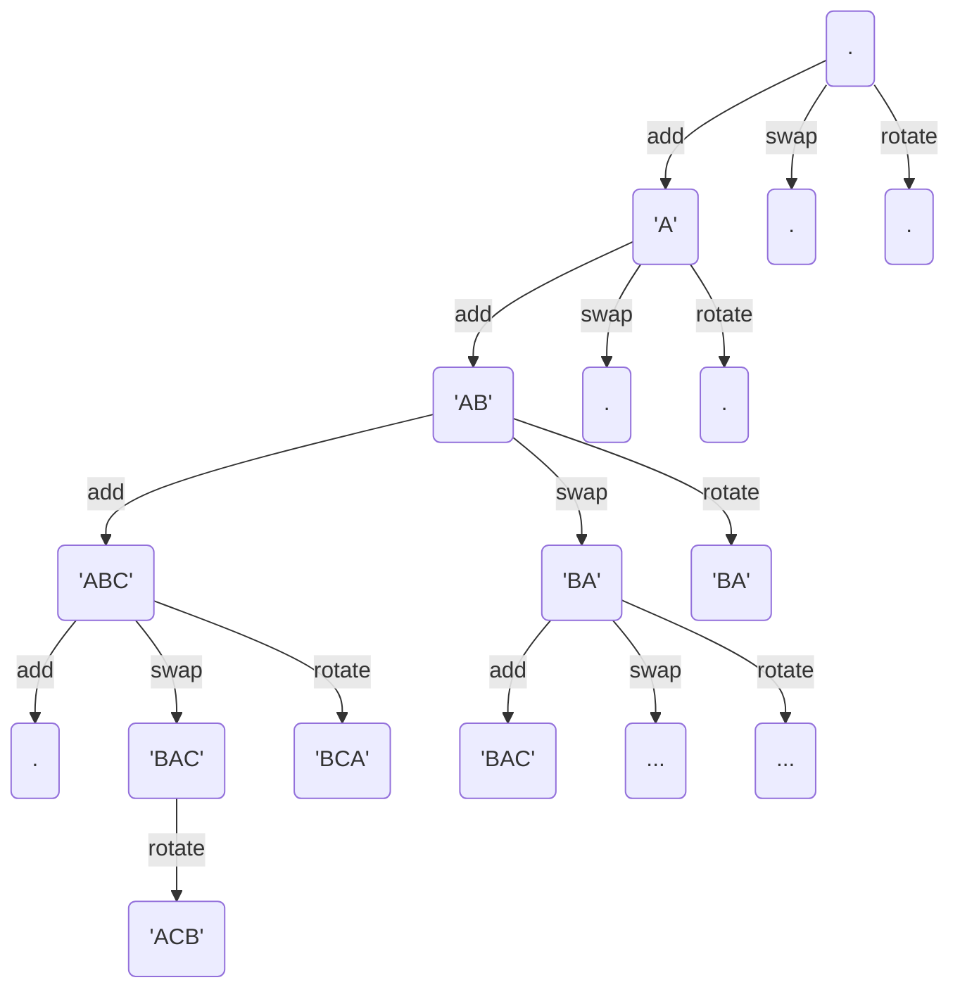

#bio
# window dressing
---
> A doable BIO 2021 Q3


# Explanation
---
Unlike recent years, this question luckily did not feature any whacky permutations, but could be easily done using a [[complete search]] and [[BFS]] on a pairs of strings.



# Code
---
```cpp

void solve(int tc)
{
	string s; cin >> s;
	string start = "";
	for(char i = 'A'; i < 'A'+s.length(); i++)
		start += i;
	queue<pair<pair<string,string>,int>> q;
	map<pair<string,string>,bool> vis;
	q.push(mp(mp(start,""),0));
	vis[mp(start,"")] = true;

	while(!q.empty())
	{
		pair<pair<string,string>,int> node = q.front();q.pop();
		pair<string,string> cur = node.first;
		if(cur.second==s)
		{
			cout << node.second << "\n";
			return;
		}
		pair<string,string> tmp;

		// add
		if(cur.first.length() > 0){
			tmp = cur;
			tmp.second += tmp.first[0];
			tmp.first.erase(0,1);

			if(!vis.count(tmp))
			{
				vis[tmp] = true;
				q.push(mp(tmp,node.second+1));
			}
		}

		//swap
		if(cur.second.length() >= 2)
		{
			tmp = cur;
			char mem = tmp.second[0];
			tmp.second[0] = tmp.second[1];
			tmp.second[1] = mem;
			
			if(!vis.count(tmp))
			{
				vis[tmp] = true;
				q.push(mp(tmp,node.second+1));
			}
		}

		//rotate
		if(cur.second.length() > 0)
		{
			tmp = cur;
			tmp.second += tmp.second[0];
			tmp.second.erase(0,1);
			if(!vis.count(tmp))
			{
				vis[tmp] = true;
				q.push(mp(tmp,node.second+1));
			}
		}

	}

}
```